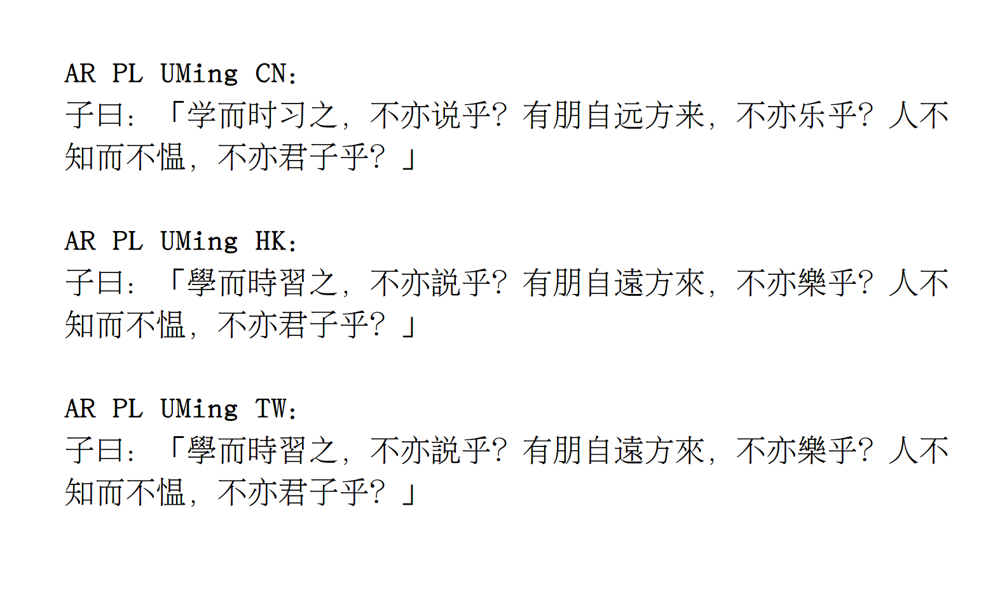
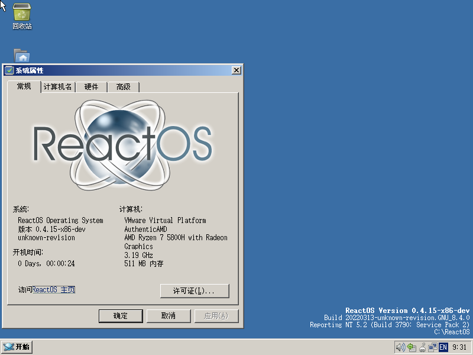
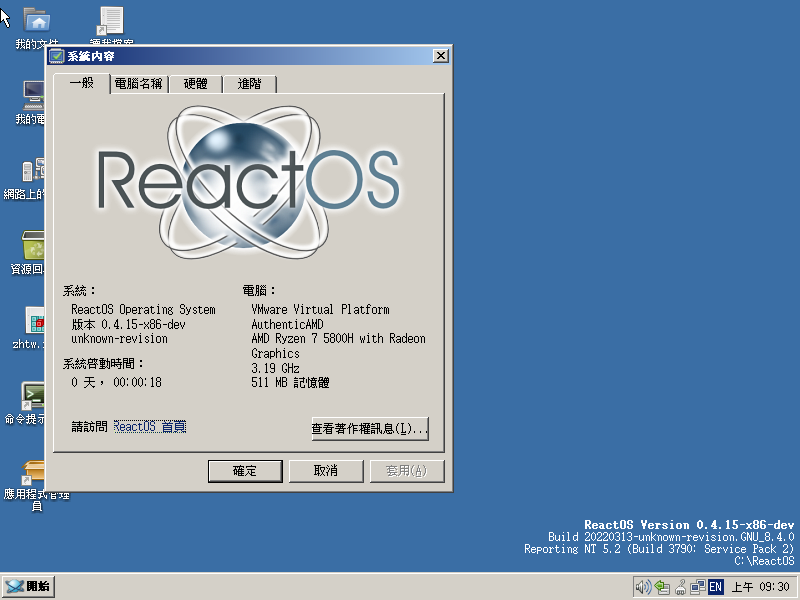

# AR PL UMing for ReactOS Package

See the original README file : [README.origin](README.origin) .

The unmodified font source files are in the [master branch](https://github.com/jsluke2021/ttf-arphic-uming-reactos/tree/master).

This is a package of AR PL UMing fonts for ReactOS. It is only supported for Simplified Chinese (PRC), Traditional Chinese (Hong Kong and Taiwan). 

This font was developed by Arphic Technology Co., Ltd. in Taiwan. 

Releases: [click here](https://github.com/jsluke2021/ttf-arphic-uming-reactos/releases).

## How to install
1. Install uming.ttc to the OS fonts folder.
2. Backup your registry entry called "HKEY_LOCAL_MACHINE\SOFTWARE\Microsoft\Windows NT\CurrentVersion\FontSubstitutes".
3. Import the registry file in the Install-for-reactos folder.

## Screenshots
Simplified Chinese:

Traditional Chinese:

# License
Licensed under the Arphic Public License, see "license" folder.
